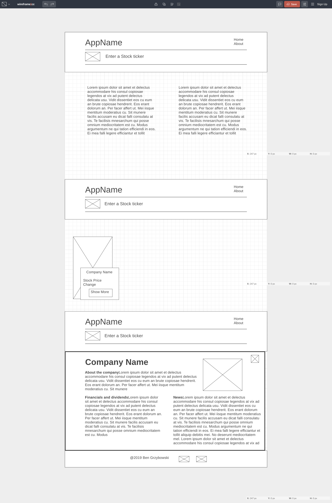

# "Invest" Project Overview 
### Project Description
This is an investment research app. You can look up a company and get a stock quote, dividend information, company information current company news.

### API
https://iexcloud.io/

### Wireframes

#### MVP
* User can enter a stock ticker
* 5 apis will be called
* Quote and image will be displayed and can link to additional info
* User clicks more info and new, company info and financials are displayed.   

#### POST MVP
* Styled the image and company card with a transform to rotate 30° by default and rotating back on hover. This make the card and image move when hovered over.
* Added a filtered autocomplete text search for company name. This allowas the user to quickly find the company and does not require them to know the stock symbol.
* Added a parallax help page.
* Added a full page overlay to display Co details, dividends, contact info and news. 
* Added local storage for the initial list of companies. This was making an api call and returning 10K companies each time the app loaded. I changed this to use local storage to cache the list.

#### Functional Components
* Header
	* Home
		* Form
			* Options
		* Main
			* Company
				* CompanyDetails
					* Dividends
					* News  
* Footer

### Component	Description
**Header** - This will render the header include the nav.  
**Footer** -	This will render the header include the nav.  
**Home** - This will render the Form and main.   
**Form** - This will render the search and options.  
**Options** - This will render the filtered autocomplete options.   
**Main** - This will render the company.   
**Company** - This will render the company card(s) and image(s).   
**CompanyDetails** - This will render the Company Information(description), image, dividend information, news and address.   
**Dividends** - This will render dividends.   
**News** - This will render news.   

Component  | Priority | Estimated Time | Time Invetsted
---------- | -------- | -------------- | --------------
Header  | Low | 1hr  | .5hrs
Footer | Low | 1hr | .5hrs
Home | Med | 2hrs | 1hr
Form | High | 1hrs | 1hrs
Options | Low | 1hrs | 1hrs
Main | High | 2hrs | .5hrs
Company | High | 2hrs | 1hr
CompanyDetails | High | 2hrs | 1hr
Dividends | Med | 2hrs | .5hr
News | Med | 2hrs | .5hr
App.js | High | 10hrs | 10hrs

###Issues and Resolutions
* Changing style of elements at runtime. I first used the dom to manipulate the style and ran into issues. I got it to work, but it was bad design. I ended up creating a style object and used conditional rendering.
* Issue retrieve from local storage.  I was doing a check if the object in local storage was 'undefined', but did not use the "typeof".